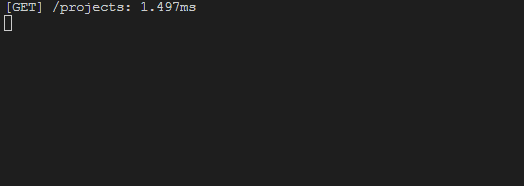

<h1>React Native App</h1>

This is a simple project where the app search for items from an API using Axios and then list them. There is the functionality to add new items with standard data (button "ADD PROJ") and delete existing items (pressing an item). 

 
 
 

 

